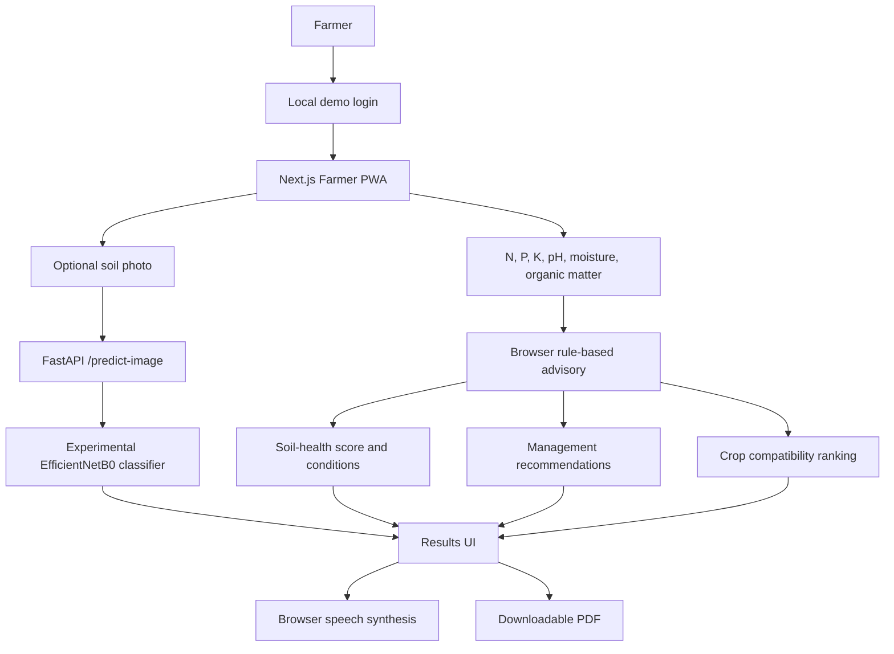

# Kisan Soil Advisor / Farmer Soil Analysis PWA

Kisan Soil Advisor is a mobile-first prototype for reviewing soil-test readings and receiving farmer-friendly soil-health, nutrient-management, and crop-compatibility guidance. It combines a Next.js PWA, a FastAPI API, a browser-side rule-based advisory, and an experimental four-class soil-image classifier.

**The image classifier identifies a broad soil-image class only. It does not measure N, P, K, pH, moisture, or organic matter.** Use laboratory soil results and local agricultural guidance for field decisions; this prototype is not a laboratory diagnosis or fertilizer prescription.

## 1. Project overview

Soil-test readings and general recommendations can be difficult to interpret on a phone. This prototype presents six separately supplied soil readings, their rule-based conditions, a transparent soil-health score, cautious management suggestions, and crop-compatibility rankings. A separate CNN endpoint can classify an uploaded image as Alluvial, Black, Clay, or Red Soil.

The intended users are farmers, students, and project evaluators exploring a soil-advisory workflow. The login is a local demo gate only; it is not account authentication.



## 2. Key features

### Authentication

The login and protected dashboard use a browser-local demo session. Any non-empty identifier and password can create a session; no credential is verified and no account service exists. Do not enter a real password.

### Soil image analysis

The PWA accepts an image selection or camera capture, checks that the file is an image smaller than 10 MB, shows a preview, and can send it to FastAPI. The backend accepts JPEG/PNG MIME types, applies the 10 MiB size limit, decodes the image, and resizes it to 224 x 224 RGB for the CNN. Images are not used to infer nutrient readings.

### CNN soil classification

The experimental TensorFlow/Keras EfficientNetB0-based CNN returns one of four classes, a model score, and per-class probabilities. Predictions can be wrong and are visibly described as experimental. The model is independent of the rule-based nutrient, soil-health, and crop calculations.

### Soil readings and advisory

The app accepts N, P, K (mg/kg or ppm), pH, moisture (%), and organic matter (%). It displays condition bands, a rule-based score and grade, management suggestions with cautions, and the five highest-ranked crop compatibility results. The advice does not prescribe universal fertilizer application rates.

### Farmer PWA

The Next.js/TypeScript app includes a dashboard, mobile-first analysis form, image preview/camera input, loading and error states, recent-analysis history in the current browser, language selection, voice controls, PDF generation, a web manifest, and a service worker. History is not synced between browsers or devices.

## 3. CNN training pipeline

The initial model checkpoint was developed in Google Colab, exported as a `.keras` file, and transferred through Google Drive into `model_artifacts/`. The repository also includes `scripts/train_soil_cnn_experiment.py` for the corrected-preprocessing experimental retraining workflow. It uses TensorFlow/Keras, the saved EfficientNetB0 checkpoint, 224 x 224 RGB images, `image_dataset_from_directory`, a four-class classification head, and a `.keras` export. The candidate uses raw pixel values in the expected 0-255 range; EfficientNet applies its own input rescaling. This avoids applying an extra `/255` normalization before the backbone.

The supplied evaluation is an internal split from the project dataset. Source licensing and independent external validation are not established. The dataset itself is intentionally not added in this update, so reproducing training requires separately obtaining and validating the authorized source images and the original training inputs.

## 4. Model artifacts

| Artifact | Purpose |
| --- | --- |
| `model_artifacts/soil_cnn_experimental.keras` | Current default image-inference candidate (`MODEL_PATH`); experimental retrain |
| `model_artifacts/soil_cnn_final.keras` | Existing earlier checkpoint retained as a backup |
| `model_artifacts/best_soil_model.keras` | Earlier best-checkpoint artifact retained; not the API default or current retraining source |
| `model_artifacts/soil_class_names.json` | Index-to-class mapping |
| `model_artifacts/model_metadata.json` | Candidate version, expected input, classes, and evaluation caveat |
| `model_artifacts/soil_cnn_experimental_metrics.json` | Candidate metrics and split details |
| `model_artifacts/soil_cnn_evaluation_report.txt` | Earlier checkpoint's evaluation report; it is not the candidate's 91.6% result |

Each `.keras` artifact is non-zero and approximately 19 MB, below GitHub's 100 MB per-file limit. Git LFS is not required for these files.

## 5. CNN model verification

The supplied local verification report records an input shape of `(None, 224, 224, 3)`, output shape `(None, 4)`, 4,214,055 parameters, and four class names:

| Index | Class |
| ---: | --- |
| 0 | Alluvial Soil |
| 1 | Black Soil |
| 2 | Clay Soil |
| 3 | Red Soil |

The experimental candidate's reported result is 91.61% accuracy and 90.68% macro recall on 143 images in the repository's test split. These are split-specific experimental metrics, **not** proof of real-world accuracy or independent validation. The separate earlier-checkpoint report records 30.07% accuracy and must not be confused with the candidate metrics.

## 6. Recommendation engine

The PWA's TypeScript advisory and the separate Python Week 5 module use deterministic rules for low/high N, P, and K; acidic/alkaline pH; low organic matter; and dry/wet moisture. They produce condition statuses, management guidance, and cautions. The rules are demonstration defaults and do not generate lab measurements or calibrated fertilizer rates.

## 7. Crop suitability

Crop compatibility is computed separately from CNN classification. The PWA compares the supplied readings with its crop requirement ranges, calculates a weighted range-fit score, lists limiting factors, and ranks the top five crops. The Python Week 5 implementation also ranks crops using its CSV requirement table. These scores indicate compatibility with encoded ranges, not expected yield or guaranteed suitability; local requirements need agronomic validation.

## 8. Soil-health scoring

The browser score uses six normalized range-fit indicators: N, P, K, pH, organic matter, and moisture. It averages the six indicators and presents a score from 0 to 100 with a grade. The score describes the prototype's rule bands, not a laboratory measurement or validated agronomic index. All six readings are supplied separately by the user.

## 9. Farmer PWA

The app is in `farmer-pwa/`. Its analysis and scoring run in the browser; the selected photo is sent separately to the FastAPI image endpoint when that service is available. The browser stores up to eight recent analyses locally. The manifest and service worker provide an installable app shell and caching behavior, but offline operation and installation require device-specific testing.

## 10. Voice assistance

Voice output uses the browser **Web Speech API** and `window.speechSynthesis` with `SpeechSynthesisUtterance`. It is client-side text-to-speech; no separate AI voice model was trained or deployed. The UI provides read, pause, resume, and stop controls. Available speech and pronunciation depend on browser support and installed device voices.

Implemented speech locales are English (`en-IN`), Hindi (`hi-IN`), Kannada (`kn-IN`), and Tamil (`ta-IN`).

## 11. Multilingual support

The app provides English, Hindi, Kannada, and Tamil language options for its main interface and analysis copy. This should not be read as a claim that every static page, browser error, document, or generated report is translated; the PDF content is currently English.

## 12. PDF reporting

The PWA uses jsPDF to generate `soil-health-report.pdf`. The report includes the analysis date, image classification when available, score and grade, the six readings and statuses, deficiencies identified by the app's bands, nutrient and soil-management recommendations with cautions, and ranked crop results. The report currently uses English text. Verify downloads on the target browser/device before relying on them.

## 13. Backend architecture

The FastAPI service is in `backend/app/`. The rule-based backend endpoint is implemented separately from the PWA's browser-side analysis.

| Method and path | Input | Purpose |
| --- | --- | --- |
| `GET /health` | None | Reports service health and whether the CNN is loadable |
| `GET /model-info` | None | Reports model filename, availability, input shape, and class names |
| `POST /predict-image` | Multipart JPEG/PNG `file` | Returns predicted class, confidence, per-class probabilities, and model metadata |
| `POST /analyze-soil` | JSON with N, P, K, pH, moisture, and organic matter | Returns rule-based statuses, score, recommendations, and crop ranking |
| `POST /hybrid-analysis` | Soil readings and optional image | Currently reports hybrid analysis as unavailable; it does not provide a hybrid model result |

The PWA calls `/predict-image` for image classification. Its current soil-reading calculations are performed in `farmer-pwa/lib/advisory.ts`; the page does not call `/analyze-soil`.

## 14. Frontend-to-backend flow

The browser sends only the selected image to `POST /predict-image`. FastAPI validates the upload and runs CNN inference; the JSON prediction is shown alongside the separate browser-side analysis of the six readings. If the optional image service is unavailable, the reading-based advisory can still be displayed.

## 15. Project structure

```text
.
├── backend/
│   ├── app/                 FastAPI routes, schemas, CNN and advisory services
│   ├── tests/               Backend API/model regression tests
│   └── requirements.txt
├── database/                Schema proposal; not connected to the running app
├── docs/                    API, architecture, model, data and limitation notes
├── farmer-pwa/              Current Next.js/TypeScript PWA
├── model_artifacts/         Required model checkpoints and metadata
├── scripts/                 Model verification and experimental training
├── week5/
│   ├── data/                Knowledge base and crop requirement table
│   ├── src/                 Python recommendation/scoring modules
│   └── tests/               Week 5 regression tests
├── frontend/                Earlier frontend retained from previous milestones
├── src/, tests/, data/, notebooks/
│                            Earlier milestone/research implementation retained
├── FINAL_VERIFICATION_REPORT.md
└── README.md
```

Older tracked research and dataset files remain from previous repository history. This update does not add raw soil-image datasets, extracted dataset folders, archives, virtual environments, or build output.

## 16. Technology stack

| Layer | Technology |
| --- | --- |
| Frontend | Next.js 16, React 19 |
| Language | TypeScript |
| Styling | CSS |
| Backend | FastAPI, Uvicorn, Pydantic |
| Image processing | Pillow, NumPy |
| ML | TensorFlow/Keras |
| CNN | EfficientNetB0 transfer learning |
| Voice | Web Speech API, `window.speechSynthesis` |
| PDF | jsPDF |
| PWA | Web app manifest, service worker, browser install prompt |
| Testing | Python `unittest`, TypeScript compiler, Next.js production build |

## 17. Installation

Requirements: Python 3.12 or compatible with the pinned TensorFlow release, Node.js 20.9 or later, and Corepack/pnpm. From the repository root:

```powershell
python -m venv .venv
.\.venv\Scripts\Activate.ps1
python -m pip install -r backend\requirements.txt
corepack enable
```

Install frontend dependencies using the committed pnpm lockfile:

```powershell
cd farmer-pwa
pnpm install
```

If using a shell other than PowerShell, activate the virtual environment with that platform's command. TensorFlow installation may require a compatible Python/runtime and supported hardware configuration.

## 18. Running the application

Start the API from the repository root:

```powershell
python -m uvicorn backend.app.main:app --reload --host 127.0.0.1 --port 8000
```

In a second terminal, start the PWA:

```powershell
cd farmer-pwa
pnpm dev
```

Open [http://localhost:3000](http://localhost:3000). The API is available at [http://127.0.0.1:8000](http://127.0.0.1:8000); FastAPI's interactive API documentation is at `/docs`.

## 19. Environment variables

Copy the relevant placeholders from `.env.example`; do not commit `.env` or `.env.local`.

| Variable | Used by | Purpose |
| --- | --- | --- |
| `NEXT_PUBLIC_API_URL` | PWA | FastAPI base URL; defaults to `http://localhost:8000` |
| `MODEL_PATH` | FastAPI | Model file path relative to repository root; defaults to the experimental candidate |
| `CLASS_NAMES_PATH` | FastAPI | Class mapping path |
| `MODEL_METADATA_PATH` | FastAPI | Model metadata path |
| `SOIL_ADVISOR_CORS_ORIGINS` | FastAPI | Comma-separated allowed PWA origins |

For the frontend, place `NEXT_PUBLIC_API_URL` in `farmer-pwa/.env.local`. When using a phone, set the API URL to a reachable host address instead of `localhost`, and configure the API's CORS origins to the exact frontend origin.

## 20. Testing

From the repository root:

```powershell
python -m pip install pytest
python -m pytest -q
python -m unittest discover -s backend/tests -p "test_*.py"
python -m unittest discover -s week5/tests -p "test_*.py"
python scripts/verify_cnn_model.py
```

From `farmer-pwa/`:

```powershell
pnpm exec tsc --noEmit
pnpm build
```

There is no dedicated frontend unit-test script in `farmer-pwa/package.json`. Physical Android camera, voice playback, installation, offline behavior, and saved-PDF checks are not covered by these commands.

## 21. CNN verification

Run `python scripts/verify_cnn_model.py` from the repository root. It checks that the configured candidate artifact and class map exist, attempts to load the Keras model, and checks its 224 x 224 RGB input shape and output/class count. The supplied verification report also records the model parameter count.

## 22. Security and privacy

- Never commit `.env`, `.env.local`, API keys, passwords, or credentials. Use the example files as templates.
- The demo login is not authentication; do not enter real credentials.
- Image upload MIME type and size are checked in the browser and API, and the backend attempts to decode the image before inference.
- Analysis history and the demo session are stored in the current browser's storage; they are not synchronized to a server.
- The app does not use the supplied PostgreSQL schema; the database file is a proposal only.
- Configure CORS narrowly for the frontend origins that need API access. Do not expose secrets in `NEXT_PUBLIC_*` variables.

## 23. Limitations

- A soil image does not directly measure nitrogen, phosphorus, potassium, pH, moisture, or organic matter. Those readings must be supplied separately.
- CNN metrics are from a small project split, not an independent external evaluation; image labels/data provenance and licensing are not established.
- CNN predictions can be wrong. The model is experimental and does not replace laboratory testing.
- Rule bands and crop requirements are demonstration guidance, not locally calibrated agronomic diagnosis or fertilizer prescriptions.
- The hybrid route is a placeholder; no structured ML model is available.
- Login is a local demo, history is browser-local, and there is no deployed authentication, API hosting, or connected database.
- Speech, camera capture, PDF downloads, PWA install prompts, and offline behavior vary by browser/device. Physical Android testing remains outstanding.
- Voice playback and generated PDF download were not independently confirmed on a physical device; the PDF report content is English.

## 24. Milestone 3 status

### Week 5 — Recommendation engine and crop suitability

- [x] Python rule-based recommendation/scoring modules and crop compatibility ranking are present.
- [x] Browser advisory, soil-health score, recommendations, and crop ranking are implemented.
- [x] Week 5 automated regression tests are present.
- [~] Agricultural bands and crop requirements still need local expert/laboratory validation.

### Week 6 — Farmer-friendly PWA

- [x] Mobile-first PWA, demo login/dashboard, soil inputs, image upload/camera input, and image preview.
- [x] Results, browser-local history, English/Hindi/Kannada/Tamil UI options, and browser speech controls.
- [x] PDF generation, manifest, service worker, install icons, and install prompt handling.
- [~] Device-level Android installation, camera, offline, audible speech, and saved-PDF checks remain outstanding.
- [ ] Production authentication, hosting, and persistent server-side history are not implemented.

## 25. Development history and model handoff

The image-model handoff is: Colab model development/export, transfer of the `.keras` checkpoint through Google Drive, placement of artifacts under `model_artifacts/`, then FastAPI inference locally. The corrected-preprocessing experimental retraining source uses `soil_cnn_final.keras` as its source checkpoint and saves the candidate and metrics beside the other model artifacts. FastAPI loads `soil_cnn_experimental.keras` by default. The documented local verification and API checks passed in the supplied final verification report; this does not establish external model validity.

## 26. Project status

| Component | Status |
| --- | --- |
| Farmer PWA | Implemented; build/type checks reported passing |
| FastAPI | Implemented; health, model-info, image and soil-analysis routes |
| CNN | Experimental candidate connected to image inference |
| Recommendations | Rule-based, available in browser and Python backend |
| Crop suitability | Implemented as range-fit ranking |
| Soil-health score | Implemented from six user-provided readings |
| Voice assistance | Browser TTS implemented; physical playback unverified |
| PDF | jsPDF report implemented; device download still needs confirmation |
| PWA | Manifest/service worker/install handling implemented; device install unverified |
| Testing | Backend, Week 5, model, TypeScript and build checks documented; rerun locally before release |
| Deployment | Not completed |

## 27. License

License: Not yet specified.

## 28. Contributing

1. Create a focused branch and describe the change.
2. Keep model/data claims evidence-based; do not commit credentials or unlicensed datasets.
3. Run the backend and Week 5 tests, model verification when TensorFlow is available, and the PWA type/build checks.
4. Update relevant documentation and open a pull request with validation results and known limitations.

## 29. Acknowledgements

This prototype uses Next.js, React, TypeScript, FastAPI, TensorFlow/Keras, EfficientNetB0, Pillow, NumPy, jsPDF, and the browser Web Speech API. No external contributor or dataset license is asserted here.
