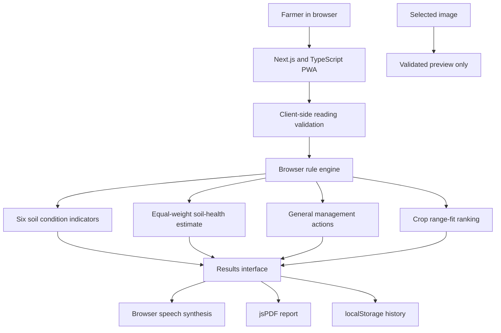

# System Architecture

## Running prototype

The TypeScript advisory lives in `farmer-pwa/lib/advisory.ts`. The independent Python recommendation and scoring modules live under `week5/src/`; they are covered by Python tests but are not imported or called by the Next.js application. Crop ranges are duplicated between those implementations and should be consolidated before operational use.

## Not connected

There is no FastAPI server, model-serving endpoint, authentication, cloud history store, or PostgreSQL connection. The browser does not call `/api/analyze`, `/api/predict-image`, or `/api/recommend`; no endpoint has been stubbed. Soil-photo input ends at local preview. EfficientNet/Grad-CAM, structured ML/SHAP, and hybrid inference are not part of the running data flow.

The PostgreSQL design in `database/schema.sql` is a future deployment proposal only.
