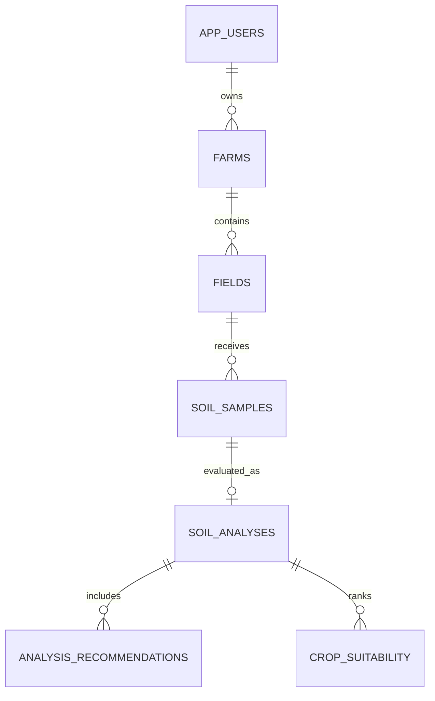

# Database Design Proposal

The current PWA does not need a server for its local rule-based demo and has no database connection. `database/schema.sql` provides a relational starting point only; it has not been applied to a running PostgreSQL instance.

## Entities



The proposed schema stores user/farm/field relationships, a dated soil sample, its six numeric readings, one analysis result, recommendation records, and ranked crop matches. Model-specific columns are nullable: no ML model currently supplies image or structured predictions.

## Apply when a PostgreSQL server is available

From the project root:

```powershell
psql "$env:DATABASE_URL" -f ".\database\schema.sql"
```

Set `DATABASE_URL` outside source control. This command and schema have not been tested against a live PostgreSQL instance. No credentials or environment file are included.
